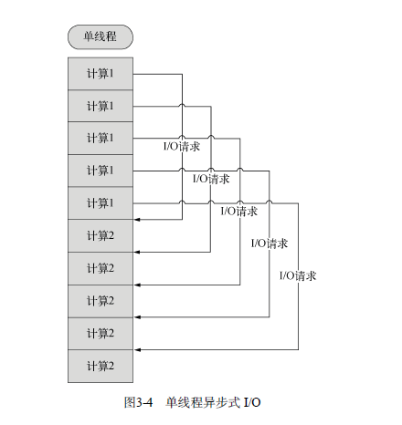
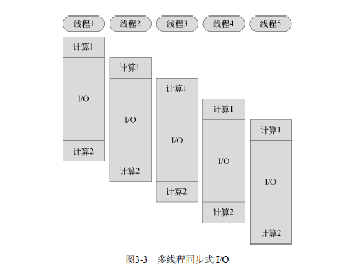

# 异步I/O

---

## 原理
什么是阻塞（block）呢？线程在执行中如果遇到磁盘读写或网络通信（统称为 I/O 操作），
通常要耗费较长的时间，这时操作系统会剥夺这个线程的 CPU 控制权，使其暂停执行，同
时将资源让给其他的工作线程，这种线程调度方式称为 阻塞。当 I/O 操作完毕时，操作系统
将这个线程的阻塞状态解除，恢复其对CPU的控制权，令其继续执行。这种 I/O 模式就是通
常的同步式 I/O（Synchronous I/O）或阻塞式 I/O （Blocking I/O）。
简单的说就是cpu和IO之间的工作原理，CPU的优先级高于IO端口，
 I/O是对图片的读取和对数据库的读取信息。



上面两个图是多线程同步式和单线程异步式操作的内容：
同步和异步的区别是同步是阻塞模式，异步是非阻塞模式。 
同步在遇到 I/O问题的时候CPU会停下来等待，而一部就不会，会执行下面的一个操作。

javascript本身是同步的操作的，简单的理解就是按照代码次序来进行操作的。
## 异步
```readfile.js
var fs = require('fs');
fs.readFile('file.txt', 'utf-8', function(err, data) {
if (err) {
console.error(err);
} else {
console.log(data);
}
});
console.log('end.');
 ```
 
 输出结果为
 ```
 end.
Contents of the file.
 ```
 当遇到I/O的时候CPU不阻塞，直接进行下一个运算。
 ## 同步
 ```
 //readfilesync.js
var fs = require('fs');
var data = fs.readFileSync('file.txt', 'utf-8');
console.log(data);
console.log('end.');
//上面代码的具体事项如下代码
function readFileCallBack(err, data) {
if (err) {
console.error(err);
} else {
console.log(data);
}
}
var fs = require('fs');
fs.readFile('file.txt', 'utf-8', readFileCallBack);
console.log('end.');
 ```
  输出结果为
 ```
 end.
Contents of the file.
 ```
 
 
 
