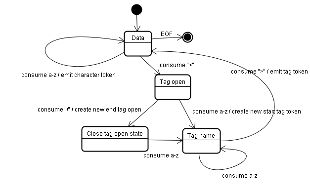

# 解析与DOM树构建

## 词法分析和语法分析。
```
2 + 3 - 1
```


## DTD（Document Type Definition，文档类型定义）
HTML 是标签。更多的来说更像是一种解析器。
```html
<!DOCTYPE HTML>
```
这边定义不同，就会用不同的标准来解析html。

## DOM

```html
<html>
  <body>
    <p>
      Hello World
    </p>
    <div> </div>
  </body>
</html>
```


### nodetype

* 元素类型	节点类型
* 元素element：1
* 属性attr	：2
* 文本text	：3
* 注释comments：8

## 解析算法

* 语言的宽容本质。
* 浏览器历来对一些常见的无效 HTML 用法采取包容态度。
* 解析过程需要不断地反复。源内容在解析过程中通常不会改变，但是在 HTML 中。
脚本标记如果包含 document.write，就会添加额外的标记，这样解析过程实际上就更改了输入内容。

### 标记化算法

``` html
<html>
  <body>
    Hello world
  </body>
</html>
```


* 遇到字符 < 时，状态更改为“标记打开状态”。
* 接收一个 a-z字符会创建“起始标记”，状态更改为“标记名称状态”。
* 遇到 > 标记时，会发送当前的标记，状态改回“数据状态”。
* <body> 标记也会进行同样的处理。重复上面的。
*  接收到 Hello world 中的 H 字符时，将创建并发送字符标记，遇到< 就停止
* 接收下一个输入字符 / 时，会创建 end tag token 并改为“标记名称状态”。
*  “>” 回到数据状态。

### 树构建算法

```
<html>
  <body>
    Hello world
  </body>
</html>
```


### HTML容错机制

 有些标签没有闭合，

```
 <br>
```
 使用一些没有定义的标签内容。

### 处理脚本和样式表的顺序

网络的模型是同步的。网页作者希望解析器遇到
```
<script>
```
标记时立即解析并执行脚本。文档的解析将停止，直到脚本执行完毕。
如果脚本是外部的，那么解析过程会停止，直到从网络同步抓取资源完成后再继续。

作者也可以将脚本标注为“defer”，这样它就不会停止文档解析，而是等到解析结束才执行。
HTML5 增加了一个选项，可将脚本标记为异步，以便由其他线程解析和执行。

样式表就是直接解析。


