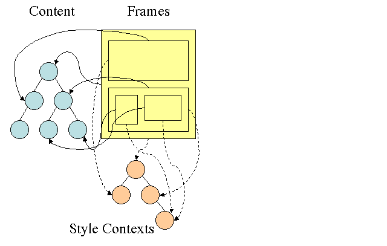
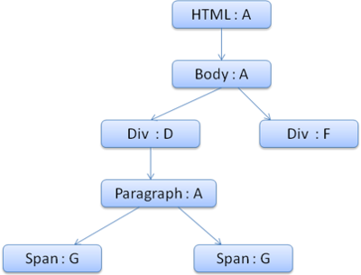

# CSS 解析

## CSS 语法
```
selector {declaration1; declaration2; ... declarationN }
```


语法是采用 BNF 格式描述的 （BNF：与上下文无关的语法）
```
ruleset
  : selector [ ',' S* selector ]*
    '{' S* declaration [ ';' S* declaration ]* '}' S*
  ;
selector
  : simple_selector [ combinator selector | S+ [ combinator? selector ]? ]?
  ;
simple_selector
  : element_name [ HASH | class | attrib | pseudo ]*
  | [ HASH | class | attrib | pseudo ]+
  ;
class
  : '.' IDENT
  ;
element_name
  : IDENT | '*'
  ;
attrib
  : '[' S* IDENT S* [ [ '=' | INCLUDES | DASHMATCH ] S*
    [ IDENT | STRING ] S* ] ']'
  ;
pseudo
  : ':' [ IDENT | FUNCTION S* [IDENT S*] ')' ]
  ;<span class="kwd"> </span>
```

以上方式用铁路图来解释就比较清楚了的。

## Webkit CSS 解析器


图：解析 CSS

## 样式计算
构建呈现树时，需要计算每一个呈现对象的可视化属性。就是那个css属性是有效的。
* HTML 中的可视化属性 bgcolor center
* inline 样式元素 style=“”
* 样式表
```
<style></style>
```
* 外部样式表
```
<link  href="css/index.css" >
```

越近的优先级越高



Firefox 样式上下文树

规则的存储是延迟进行的。规则树不会在开始的时候就为所有的节点进行计算，而是只有当某个节点样式需要进行计算时，才会向规则树添加计算的路径。
不是覆盖，而是计算。


## 结构划分
结构中的属性都是继承的或非继承的。
继承属性如果未由元素定义，则继承自其父代。非继承属性（也称为“重置”属性）如果未进行定义，则使用默认值。

font，text

## 对规则进行处理以简化匹配

系统会根据选择器将 CSS 规则添加到某个哈希表中。
这些哈希表的选择器各不相同，包括 ID、类名称、标记名称等，还有一种通用哈希表，适合不属于上述类别的规则。

```
p.error {color:red}
#messageDiv {height:50px}
div {margin:5px}
```


```
<p class="error">an error occurred </p>
<div id=" messageDiv">this is a message</div>

```

```
table div {margin:5px}
```
从右边往左边匹配

### 层叠顺序
定义不止一个，就会出现问题，需要通过层叠顺序来解决

### 层叠的顺序为（优先级从低到高）

大范围，越近越高

###权重计算

```css
*             {}  /* a=0 b=0 c=0 d=0 -> specificity = 0,0,0,0 */
li            {}  /* a=0 b=0 c=0 d=1 -> specificity = 0,0,0,1 */
li:first-line {}  /* a=0 b=0 c=0 d=2 -> specificity = 0,0,0,2 */
ul li         {}  /* a=0 b=0 c=0 d=2 -> specificity = 0,0,0,2 */
ul ol+li      {}  /* a=0 b=0 c=0 d=3 -> specificity = 0,0,0,3 */
h1 + *[rel=up]{}  /* a=0 b=0 c=1 d=1 -> specificity = 0,0,1,1 */
ul ol li.red  {}  /* a=0 b=0 c=1 d=3 -> specificity = 0,0,1,3 */
li.red.level  {}  /* a=0 b=0 c=2 d=1 -> specificity = 0,0,2,1 */
#x34y         {}  /* a=0 b=1 c=0 d=0 -> specificity = 0,1,0,0 */
style=""          /* a=1 b=0 c=0 d=0 -> specificity = 1,0,0,0 */
```
越详细，权重越高

## 使用规则树计算样式上下文
html代码

```
<html>
  <body>
    <div class="err" id="div1">
      <p>
        this is a <span class="big"> big error </span>
        this is also a
        <span class="big"> very  big  error</span> error
      </p>
    </div>
    <div class="err" id="div2">another error</div>
  </body>
</html>
```


图：上下文树

css代码
```
div {margin:5px;color:black}
.err {color:red}
.big {margin-top:3px}
div span {margin-bottom:4px}
#div1 {color:blue}
#div2 {color:green}
```


```
<html>
  <body>
    <div class="err" id="div1">
    <!--margin:5px;color:black;color:red;color:blue -->
      <p>
      <!--p标签没有定义，但是color时可以继承的属性，color:blue -->
        this is a <span class="big" > big error </span>
        <!--big margin-top:3px;margin-bottom:4px -->
        this is also a
        <span class="big"> very  big  error</span> error
      </p>
    </div>
    <div class="err" id="div2">another error</div>
     <!--margin:5px;color:black;color:red;color:green -->
  </body>
</html>
```


