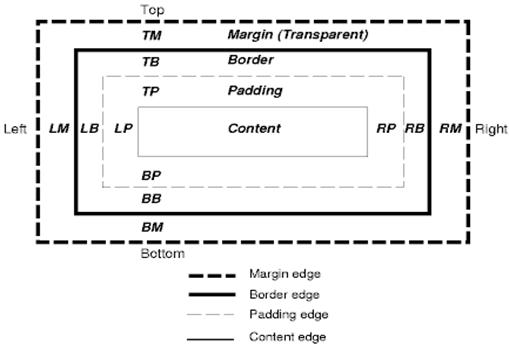

# 布局

## 流布局
HTML 采用基于流的布局模型

布局可以按从左至右、从上至下的顺序遍历文档。

##CSS2 可视化模型

图：CSS2 框模型

## 定位方案

* 普通：流布局。
* 浮动：对象先按照普通流进行布局，然后尽可能地向左或向右移动，浮动定位。
* 绝对：对象在呈现树中的位置和它在 DOM 树中的位置不同，绝对定位。

## 绘制顺序
块呈现器的堆栈顺序如下：
* 背景颜色
* 背景图片
* 边框
* 子代
* 轮廓

