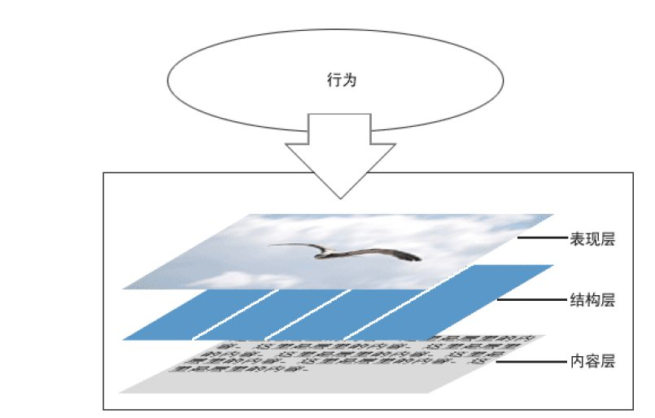
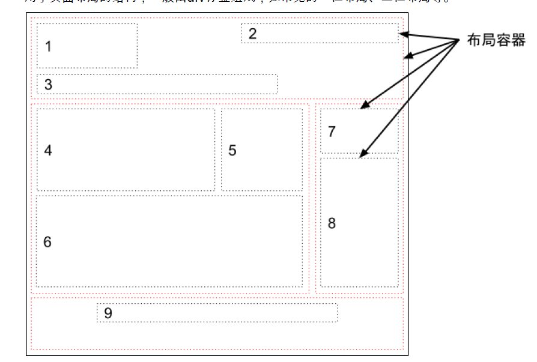

# 模块化

#### 相同的html结构写不同的效果。


#### 如何实现HTML、和CSS代码的简洁与灵活？

内容、结构、表现、行为分离。
其实我认为这是MVC的扩展。



## 模块化
### 定义
模块化是指解决一个复杂问题时自顶向下逐层把系统划分成若干模块的过程。每个模块完成一个特定的子功能，所有的模块按某种方法组装起来，成为一个整体，完成整个系统所要求的功能。
在系统的结构中，模块是可组合、分解和更换的单元。

### 要求
将HTML和CSS通过一定的规则进行分类、组合，以达到特定HTML、CSS在特定范围内最大程度的复用。

关键词：规则 、 特定范围 、 最大程度的复用，

### 模块分类

layout 布局模块
model  容器模块
content 内容模块

### HTML模块化
HTML语义化+对应的class的定义
```
内容模块原型
<div class="基类 扩展类 实例类">
<div>...</div>
</div>
```


```
<div class="mod-tab-1 new-mod-tab-name">
<div>...</div>
</div>
```

这边就要计算那个css属性是有效的：
样式分类+权重计算

## 面向对象
* 封装
    一定的作用范围
* 继承
   实例类对基类的继承
* 多态
   实例类可以通过css层叠机制，来实现多态


